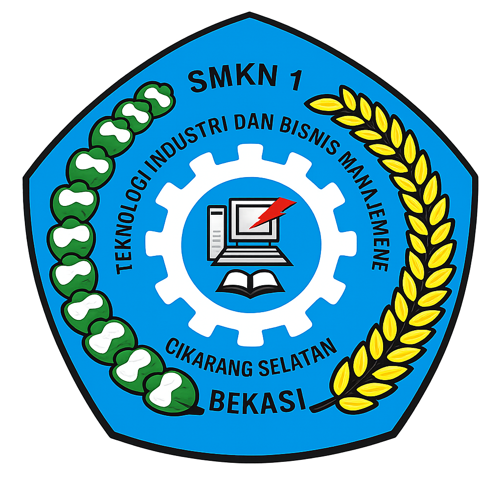

<div align="center">



# SIM Lab TJKT
### Sistem Informasi Manajemen Inventaris Laboratorium

**SMKN 1 Cikarang Selatan — Lab Teknik Jaringan Komputer dan Telekomunikasi**

[](https://python.org)
[](https://flask.palletsprojects.com)
[](https://mysql.com)
[](https://getbootstrap.com)
[](#)
[](#)

---

*Proyek Kerja Praktek (KP) — Semester 6 — Universitas Pelita Bangsa — 2024*

</div>

---

## Daftar Isi

- [Tentang Sistem](#tentang-sistem)
- [Fitur Utama](#fitur-utama)
- [Teknologi](#teknologi)
- [Struktur Proyek](#struktur-proyek)
- [Instalasi & Setup](#instalasi--setup)
- [Cara Menjalankan](#cara-menjalankan)
- [Migrasi Database](#migrasi-database)
- [Akses dari HP](#akses-dari-hp)
- [Dokumentasi API](#dokumentasi-api)
- [Struktur Database](#struktur-database)
- [Tim Pengembang](#tim-pengembang)

---

## Tentang Sistem

SIM Lab TJKT adalah sistem informasi berbasis web yang dibangun untuk mengelola seluruh aset dan inventaris di Laboratorium TJKT SMKN 1 Cikarang Selatan. Sistem ini menggantikan pencatatan manual yang sebelumnya menggunakan buku dan spreadsheet terpisah.

Dengan sistem ini, pengelola laboratorium dapat:

- Mencatat dan memantau kondisi setiap perangkat secara real-time
- Melacak peminjaman barang beserta identitas peminjam dan waktu pengembalian
- Mengelola stok barang habis pakai seperti kabel UTP dan konektor RJ45
- Melakukan scan QR Code dari smartphone untuk melihat detail dan status barang
- Mengekspor laporan inventaris, peminjaman, dan riwayat pemakaian ke Excel atau PDF
- Melacak setiap unit fisik barang yang dinomori (misalnya Tablet No.1 s/d No.15)

---

## Fitur Utama

### Inventaris Tetap
- CRUD data barang dengan kode otomatis berformat `KOM-2024-0001`
- Filter berdasarkan kategori, jenis aset, dan kondisi
- Sorting multi-kolom dengan pagination
- QR Code otomatis di-generate saat barang ditambahkan
- Cetak label QR dalam format grid 3 kolom siap cetak

### Unit Tracking *(Fitur Khusus)*
- Untuk barang yang setiap unitnya perlu dilacak terpisah (Tablet, Laptop, Kamera)
- Setiap unit mendapat kode unik (`TAB-2024-0001-U07`) dan QR Code sendiri
- Tambah banyak unit sekaligus (bulk) dengan nomor berurutan
- Status per unit: Tersedia / Dipinjam, kondisi per unit: Baik / Rusak Ringan / Rusak Berat
- Cetak label QR semua unit dalam satu halaman

### Barang Habis Pakai (Consumable)
- Manajemen stok dengan kode `CSM-KBL-2024-0001`
- Tiga jenis transaksi: Restock, Pemakaian, Koreksi stok
- Alert visual jika stok di bawah batas minimum
- Pencatatan nama pemakai, kelas, dan mata pelajaran per transaksi
- QR Code per item untuk akses cepat via smartphone

### Peminjaman & Pengembalian
- Sistem peminjaman dengan tanggal dan jam yang presisi
- Deteksi otomatis keterlambatan pengembalian
- Jika barang pakai unit tracking: pilih nomor unit yang dipinjam
- Tombol pengembalian langsung dari halaman hasil scan QR
- Riwayat peminjaman tetap tersimpan meski barang sudah dihapus dari inventaris

### QR Code & Scanner
- QR Code di-generate otomatis menggunakan IP server aktual (bukan hardcode)
- Scanner berbasis kamera browser — tidak perlu aplikasi tambahan
- Deteksi otomatis tipe barang: inventaris tetap / unit / habis pakai
- Tampilkan tombol Pinjam atau Kembalikan langsung di hasil scan

### Export Laporan
- Export inventaris tetap, peminjaman, habis pakai, dan riwayat stok ke Excel & PDF
- Filter waktu: Hari Ini / 7 Hari / 1 Bulan / 1 Tahun
- Label periode tercantum di judul laporan

### Pencarian Global
- Kotak pencarian aktif di semua halaman (shortcut `/` atau `Ctrl+K`)
- Mencari sekaligus di inventaris, habis pakai, peminjaman, dan riwayat stok
- Keyword di-highlight dalam hasil pencarian

### Dashboard
- Kartu statistik inventaris dan habis pakai secara real-time
- Grafik kondisi barang, distribusi kategori, dan jenis aset
- Daftar peminjaman yang mendekati batas waktu

### Launcher GUI Desktop
- Jalankan server tanpa membuka terminal
- Cek dan start MySQL otomatis sebelum Flask dijalankan
- Indikator status MySQL dan server, log real-time, minimize ke system tray

---

## Teknologi

| Komponen | Teknologi | Versi |
|---|---|---|
| Backend | Python + Flask | 3.9+ / 3.0 |
| Database | MySQL via XAMPP | 8.0 |
| Driver | Flask-MySQLdb | 1.0.1 |
| Frontend | HTML5 + Bootstrap | 5.3.2 |
| Ikon | Bootstrap Icons | 1.11.3 |
| Font | Plus Jakarta Sans + JetBrains Mono | — |
| Chart | Chart.js | 4.x |
| QR Generator | Python qrcode + Pillow | 7.4.2 / 10.2.0 |
| QR Scanner | html5-qrcode | 2.3.8 |
| Export Excel | openpyxl | 3.1.2 |
| Export PDF | ReportLab | 4.1.0 |
| Auth | bcrypt | 4.1.2 |
| GUI Launcher | PyQt6 | 6.6.1 |

---

## Struktur Proyek

```
lab_inventory/
│
├── app.py                          # Backend Flask — entry point utama
├── launcher.py                     # GUI launcher PyQt6
├── requirements.txt                # Dependensi Python
├── database.sql                    # Skema database + data contoh
├── migrasi_unit_tracking.sql       # Migrasi untuk fitur unit tracking
├── README.md                       # Dokumentasi ini
│
├── JALANKAN.bat                    # Skrip satu klik untuk menjalankan
├── SETUP_OTOMATIS.bat              # Setup awal: MySQL service + shortcut
│
├── static/
│   ├── css/style.css               # Stylesheet utama
│   ├── js/main.js                  # JavaScript global
│   ├── img/
│   │   ├── icon_sekolah.png        # Logo SMKN 1 Cikarang Selatan
│   │   └── logo_universitas.png    # Logo Universitas Pelita Bangsa
│   └── qr/                         # QR Code PNG (di-generate otomatis)
│
└── templates/
    ├── base.html                   # Layout utama: sidebar, navbar, search
    ├── login.html                  # Halaman login
    ├── dashboard.html              # Dashboard statistik & grafik
    │
    ├── barang.html                 # Daftar inventaris tetap
    ├── barang_form.html            # Form tambah/edit barang
    ├── detail.html                 # Detail barang (target QR scan)
    ├── cetak_label.html            # Cetak label QR inventaris
    │
    ├── barang_unit.html            # Daftar unit per barang
    ├── barang_unit_form.html       # Form tambah/edit unit
    ├── detail_unit.html            # Detail unit (target QR scan unit)
    ├── unit_cetak_label.html       # Cetak label QR semua unit
    │
    ├── consumable.html             # Daftar barang habis pakai
    ├── consumable_form.html        # Form tambah/edit item
    ├── consumable_transaksi.html   # Form transaksi stok
    ├── consumable_riwayat.html     # Riwayat transaksi stok
    ├── consumable_detail.html      # Detail habis pakai (target QR scan)
    │
    ├── peminjaman.html             # Daftar peminjaman
    ├── peminjaman_form.html        # Form catat peminjaman
    ├── peminjaman_kembalikan.html  # Form catat pengembalian
    ├── peminjaman_detail.html      # Detail satu transaksi
    │
    ├── barang_riwayat.html         # Riwayat pemakaian inventaris
    ├── scanner.html                # Halaman scan QR via kamera
    ├── riwayat.html                # Log scan QR
    ├── search.html                 # Hasil pencarian global
    ├── about.html                  # Tentang sistem & tim
    └── 404.html                    # Halaman error
```

---

## Instalasi & Setup

### Prasyarat

- Windows 10/11
- [XAMPP](https://www.apachefriends.org/) untuk MySQL
- [Python 3.9+](https://python.org/downloads/) — centang **"Add Python to PATH"** saat install

### Langkah 1 — Letakkan Folder Proyek

Letakkan folder proyek di lokasi yang mudah diakses, misalnya `C:\lab_inventory\`

### Langkah 2 — Install Dependensi Python

Buka Command Prompt di folder proyek:

```bash
pip install -r requirements.txt
```

> **Jika error `mysqlclient` di Windows:** Install [Microsoft C++ Build Tools](https://visualstudio.microsoft.com/visual-cpp-build-tools/) terlebih dahulu, kemudian ulangi perintah di atas.

### Langkah 3 — Setup Database

1. Buka XAMPP Control Panel → klik **Start** pada MySQL
2. Buka `http://localhost/phpmyadmin` di browser
3. Klik **New** → nama database: `inventaris_lab` → klik **Create**
4. Pilih database `inventaris_lab` → klik tab **Import** → pilih file `database.sql` → klik **Go**

### Langkah 4 — Setup Otomatis (Rekomendasi)

Jalankan sekali untuk kenyamanan jangka panjang:

```
Klik kanan SETUP_OTOMATIS.bat → Run as Administrator
```

Skrip ini mendaftarkan MySQL sebagai Windows Service (menyala otomatis saat booting) dan membuat shortcut **"SIM Lab TJKT"** di Desktop.

---

## Cara Menjalankan

### Cara 1 — Satu Klik (untuk Guru)

Setelah setup awal, cukup klik dua kali ikon **"SIM Lab TJKT"** di Desktop atau `JALANKAN.bat` di folder proyek. Browser akan terbuka otomatis ke halaman login.

### Cara 2 — GUI Launcher

```bash
python launcher.py
```

### Cara 3 — Terminal (untuk Developer)

```bash
# Pastikan MySQL sudah aktif di XAMPP
python app.py
# Akses: http://localhost:5000
```

### Akun Default

| Username | Password |
|---|---|
| `admin` | `admin123` |

---

## Migrasi Database

### Fitur Unit Tracking

Jika database sudah ada dari versi sebelumnya, import file migrasi:

```
phpMyAdmin → pilih database inventaris_lab → Import → pilih migrasi_unit_tracking.sql → Go
```

Atau jalankan via tab SQL di phpMyAdmin:

```sql
ALTER TABLE barang
    ADD COLUMN IF NOT EXISTS has_unit_tracking TINYINT(1) DEFAULT 0;

ALTER TABLE peminjaman
    ADD COLUMN IF NOT EXISTS unit_id   INT NULL,
    ADD COLUMN IF NOT EXISTS kode_unit VARCHAR(40) NULL;

CREATE TABLE IF NOT EXISTS barang_unit (
    id         INT AUTO_INCREMENT PRIMARY KEY,
    barang_id  INT NOT NULL,
    kode_unit  VARCHAR(40) NOT NULL UNIQUE,
    nomor_unit VARCHAR(20) NOT NULL,
    label_unit VARCHAR(100),
    kondisi    ENUM('Baik','Rusak Ringan','Rusak Berat') DEFAULT 'Baik',
    status     ENUM('Tersedia','Dipinjam') DEFAULT 'Tersedia',
    qr_path    VARCHAR(255),
    keterangan TEXT,
    created_at TIMESTAMP DEFAULT CURRENT_TIMESTAMP,
    updated_at TIMESTAMP DEFAULT CURRENT_TIMESTAMP ON UPDATE CURRENT_TIMESTAMP,
    FOREIGN KEY (barang_id) REFERENCES barang(id) ON DELETE CASCADE
) ENGINE=InnoDB;
```

### Riwayat Tidak Terhapus saat Barang Dihapus

```sql
ALTER TABLE peminjaman DROP FOREIGN KEY IF EXISTS peminjaman_ibfk_1;
ALTER TABLE peminjaman MODIFY COLUMN barang_id INT NULL,
    ADD CONSTRAINT fk_peminjaman_barang
    FOREIGN KEY (barang_id) REFERENCES barang(id) ON DELETE SET NULL;

ALTER TABLE riwayat_scan DROP FOREIGN KEY IF EXISTS riwayat_scan_ibfk_1;
ALTER TABLE riwayat_scan MODIFY COLUMN barang_id INT NULL,
    ADD CONSTRAINT fk_scan_barang
    FOREIGN KEY (barang_id) REFERENCES barang(id) ON DELETE SET NULL;

ALTER TABLE riwayat_stok DROP FOREIGN KEY IF EXISTS riwayat_stok_ibfk_1;
ALTER TABLE riwayat_stok MODIFY COLUMN barang_id INT NULL,
    ADD CONSTRAINT fk_stok_barang
    FOREIGN KEY (barang_id) REFERENCES barang_habis_pakai(id) ON DELETE SET NULL;
```

---

## Akses dari HP

Pastikan HP dan komputer terhubung ke WiFi yang sama.

**Temukan IP komputer:**

```bash
# Windows — buka Command Prompt
ipconfig
# Lihat: IPv4 Address → misal: 192.168.1.5
```

**Akses dari browser HP:**

```
http://192.168.1.5:5000
```

QR Code otomatis menggunakan IP aktual server sehingga langsung bisa di-scan dari HP tanpa konfigurasi tambahan.

---

## Dokumentasi API

Endpoint API digunakan oleh scanner untuk mengambil data barang tanpa login.

### `GET /api/barang/<kode>`

```json
{
  "status": "found",
  "data": {
    "id": 1,
    "kode_barang": "KOM-2024-0001",
    "nama_barang": "PC Desktop Core i5",
    "kondisi": "Baik",
    "has_unit_tracking": 0,
    "peminjaman_aktif": null,
    "units": []
  }
}
```

### `GET /api/consumable/<kode>`

```json
{
  "status": "found",
  "data": {
    "kode_barang": "CSM-KBL-2024-0001",
    "nama_barang": "Kabel UTP Cat6",
    "stok_sekarang": 320,
    "stok_minimum": 50,
    "satuan": "meter"
  }
}
```

### `GET /api/unit/<kode_unit>`

```json
{
  "status": "found",
  "tipe": "unit",
  "data": {
    "id": 7,
    "kode_unit": "TAB-2024-0001-U07",
    "nomor_unit": "7",
    "nama_barang": "Tab Samsung Galaxy",
    "kondisi": "Baik",
    "status": "Tersedia",
    "peminjaman_aktif": null
  }
}
```

---

## Struktur Database

### Tabel

| Tabel | Fungsi |
|---|---|
| `users` | Akun admin sistem |
| `barang` | Inventaris tetap |
| `barang_unit` | Unit fisik per barang (unit tracking) |
| `peminjaman` | Transaksi peminjaman & pengembalian |
| `riwayat_scan` | Log setiap scan QR |
| `barang_habis_pakai` | Stok barang habis pakai |
| `riwayat_stok` | Log setiap transaksi stok |

### Format Kode

| Tipe | Format | Contoh |
|---|---|---|
| Inventaris Tetap | `[PREFIX]-[TAHUN]-[NOURUT]` | `KOM-2024-0001` |
| Unit Barang | `[KODE_INDUK]-U[NN]` | `TAB-2024-0001-U07` |
| Barang Habis Pakai | `CSM-[PREFIX]-[TAHUN]-[NOURUT]` | `CSM-KBL-2024-0001` |
| Peminjaman | `PJM-[YYYYMMDD]-[NOURUT]` | `PJM-20240415-0003` |

### Prefix Kategori

**Inventaris Tetap:** `KOM` Komputer · `MON` Monitor · `NET` Jaringan · `PRP` Peripheral · `PRN` Printer · `PWR` Listrik · `SCN` Scanner · `FRN` Furnitur · `LNY` Lainnya

**Habis Pakai:** `KBL` Kabel & Konektor · `ALT` Alat & Komponen · `KRT` ATK & Kertas · `BHN` Bahan Praktek · `LNY` Lainnya

---

## Tim Pengembang

Dikembangkan sebagai tugas mata kuliah **Kerja Praktek (KP)** Semester 6 di **Universitas Pelita Bangsa**.

| Nama | NIM | Peran |
|---|---|---|
| Ahmad Fauzi Ramadhan | 2211501001 | Perancangan Sistem — ERD, DFD, Wireframe, Waterfall |
| Rizky Dwi Prasetyo | 2211501024 | Implementasi Backend — Flask, MySQL, QR, API |
| Siti Nurhaliza | 2211501047 | Implementasi Frontend — Bootstrap, Chart.js, Scanner |

**Dosen Pembimbing:** Dr. Budi Santoso, M.Kom.

**Sekolah Mitra:** SMKN 1 Cikarang Selatan, Bekasi — Lab TJKT

---

## Catatan Teknis

- Folder `static/qr/` harus memiliki permission write untuk menyimpan QR Code yang di-generate
- Gunakan `debug=False` dan `use_reloader=False` saat menjalankan Flask dari thread (launcher GUI)
- Kode barang menggunakan `MAX()` bukan `COUNT()` untuk menghindari duplikasi setelah penghapusan data
- Riwayat peminjaman dan transaksi stok menggunakan `ON DELETE SET NULL` agar data historis tidak ikut terhapus saat barang dihapus
- QR Code menggunakan IP dari `request.host` sehingga otomatis menyesuaikan jaringan aktif

---

<div align="center">

© 2024 SIM Lab TJKT — Proyek Kerja Praktek

*SMKN 1 Cikarang Selatan · Universitas Pelita Bangsa*

</div>
